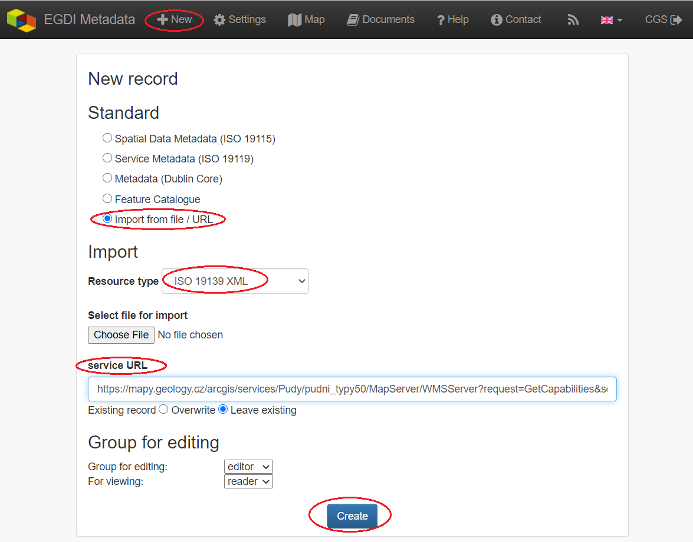
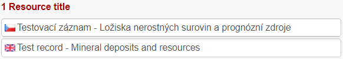
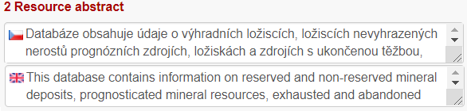
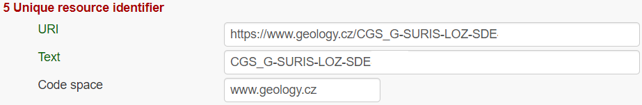
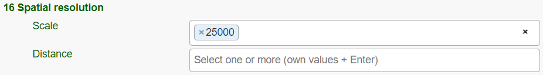
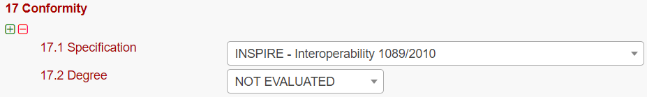
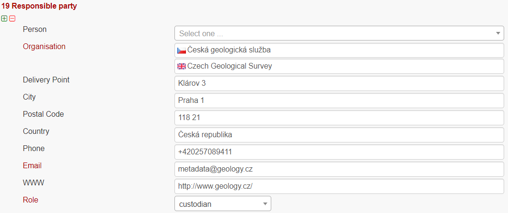
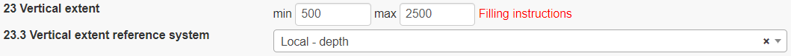

============================================================
Metadata Cookbook Lite
============================================================

Abstract
========

The EGDI Metadata catalogue
(`https://egdi.geology.cz/ <https://egdi.geology.cz/>`__) is the central
access point to metadata concerning structured digital geological data
sources and web services across Europe. It provides tools for
compilation of those metadata in a standardized format that will allow
users to effectively search through the catalogue, view and further use
the metadata. In order to make data discoverable in the most efficient
way, the catalogue is fully compliant with international standards and
supports the distributed system of metadata administration. Only digital
and structured information (spatial datasets or dataset series and
spatial data services - WMS, WFS) should be described by metadata in
this catalogue. In order to display a metadata record for which an
on-line map service is available, the Metadata catalogue is integrated
into the EGDI Portal.

Introduction
============

This document shows how to use the EGDI Metadata catalogue and how to
fill EGDI metadata step by step. The Cookbook guides the user to create
a metadata record on an example for a spatial dataset (the most frequent
option) with an extension to describe 3D geological models.

The EGDI metadata profile is compliant with the requirements of the
INSPIRE Directive as regards metadata, and the EN ISO 19115:2003(E)
terminology is implemented and it is described in more technical details
in a separate document [1].

The EGDI metadata are freely accessible to the public for viewing and
searching, but inserting and editing is for authorized users only. The
login information can be obtained on request from the administrator via
email (**egdi.metadata@geology.cz**).

The EGDI Metadata catalogue is available from:
`https://egdi.geology.cz/ <https://egdi.geology.cz/>`__. Figure 1 shows
the home page of the catalogue with the search interface and the list of
found records. Figure 2 shows a detailed view of one metadata record
with additional functionality for authorized users highlighted.

|image1|

Figure 1: The home page of the EGDI Metadata catalogue
(https://egdi.geology.cz/)

.. _section-3:

|obr3|

Figure 2: Basic view of a metadata record

Metadata input by harvesting 
============================

**The first and the most recommended way for metadata creation is
harvesting from another metadata catalogue.** By using this approach,
metadata are maintained at the most appropriate level (only once and
close to the data source – that should ensure easier maintenance and
update processes). Metadata can be inserted into the catalogue **by
harvesting** of existing records from a data provider’s catalogue, as
well as from a national, project, or other metadata catalogue.
Harvesting from remote catalogues and other sources can be set only by
the EGDI metadata catalogue **administrator** on request from the data
provider. It is possible to harvest just once (and update metadata
manually), or set a regular harvesting interval. Each harvesting session
is documented by a harvesting report with validation status that is sent
to relevant contact points.

The unique ID, resource URL, resource type, harvesting interval,
notification e-mail and status should be set for each resource. In the
list of harvested resources (see Figure 3) the last update is shown for
each resource. A harvesting report is also available through RSS
channel.

.. _section-4:

|obr1a|

Figure 3: Overview of the harvesting resources for administrator

**Metadata contact person** from an organization that wants to harvest
their metadata must **send to the
administrator**\ `(egdi.metadata@geology.cz <file:///D:\Pavla\projekty\projekty_2014\Minerals4EU\cookbook\m4eu.metadata@geology.cz>`__)
the following information:

-  **URL of CS-W metadata service**

-  **resource type**

-  **harvesting interval (recommended** 1 day).

It is strongly recommended to **denominate by the keyword**
„\ **EGDI**\ ” any metadata record that should be harvested to the EGDI
metadata catalogue. This should be done by the **metadata editor** in
the source metadata catalogue.

.. _section-5:

.. Note::
   Every record is public by default after harvesting into the EGDI Metadata catalogue. Record status is described in chapter 3.3.2 in the Record Administration paragraph in more details.

Manual input of metadata
========================

**The second way of metadata creation is the manual input** directly in
the EGDI metadata catalogue as a logged-in user with editing rights.

Import from a service URL or from a file 
----------------------------------------

A metadata record can be imported by clicking “ **+ New**\ ” in the top
main menu (on https://egdi.geology.cz/record/new for logged-in users).
If an XML file (ISO 19139) with metadata is available, choose the
“\ **Import from file/URL**\ ” option on the “\ **New record / update
record**\ ” page and then either select the file from disc, or enter the
URL of the service.

**Note:**\ *“Select file for import” has a priority if both fields (file
and service URL) are filled.*

|image4|

Figure 4: Import from file or URL

By switching option "Existing record: Overwrite / Leave existing" the
user can set the rules for importing if the record already exists. 

Depending on the amount of information you are providing in the
GetCapabilities document of the service, a corresponding part of the
metadata elements will be automatically filled. You have to check this
after creating the record and add manually the missing ones according to
the rules described further in this cookbook.

Copy an existing record using the editing tools 
-----------------------------------------------

The clone icon enables the user to copy an existing record and use it as
a template for creating a new record (on the https://egdi.geology.cz/
page for logged-in users).

.. _section-6:

.. hint::
   Example records that can be used as a template (copy icon is visible just for logged-in users – Figure 5)

   - Dataset example record: https://egdi.geology.cz/record/basic/5e8b7243-18b0-4d85-ab71-36680a010833
   - 3D model example record: https://egdi.geology.cz/record/basic/5e8b358e-7998-4f71-a363-2b260a010833

.. _section-7:

|obr2b|

Figure 5: Copy record option

Creation of a new record 
------------------------

Primary settings
~~~~~~~~~~~~~~~~

A new record is created by clicking “ **+ New**\ ” in the top main menu.
New record creation dialogue is displayed on the
https://egdi.geology.cz/record/new page for logged-in users (Figure 6).

.. _section-8:

Here you should set:

-  **Standard:** you have to choose the option ISO 19115 standard
   (default) for spatial datasets, ISO 19119 for spatial data services.

-  **Access rights:** the group for editing and the group for viewing.
   The group for editing should be the **same as your username** and it
   should be set in the combo-box (more information in chapter 3.3.2 in
   the “Record administration” part).

-  **Metadata languages:** Right column (radio buttons) is intended for
   the selection of the primary language - since English was agreed as
   the **primary language** of the EGDI metadata, **English language is
   chosen by default**. Left column (check boxes) is intended for
   setting other language that will be represented in the bilingual
   elements. The language setting can also be edited during the editing
   process in the header of record (Figure 7).

-  **Then click Create.** 

A new blank record is created (Figure 7). To be able to save the record you have to fill the minimum required elements as it is described in chapter 3.3.3.

.. _section-9:

|obr2|

Figure 6: New record dialogue (https://egdi.geology.cz/record/new for
logged-in users)

General features of the editing environment
~~~~~~~~~~~~~~~~~~~~~~~~~~~~~~~~~~~~~~~~~~~

Some important features of the EGDI Metadata catalogue application that
are useful during the whole process of record editing are explained on
the next figure (Figure 7) and in the following paragraph.

.. _section-10:

|image7|

Figure 7: General features of the EGDI Metadata catalogue

**Metadata editing form**

On the top right side of the main menu at Figure 7 you can see which
editing form is displayed in the main window.

There are two editing forms available:

1. **EGDI-Lite** – user friendly, easy to fill, less options

2. **EGDI-full** – follows the ISO structure and has more options, more
   metadata knowledge and experience is required on the editor’s side

**For filling metadata according to this cookbook within the GeoERA
projects you will use the EGDI-Lite editing form!**

.. warning::
   If you start editing data in EGDI-full form and then switch to EGDI-Lite and save the record, you may lose the content of fields that are available in the EGDI-full form as an extension (see more in chapter 0). 

**Main tools**

In the top banner, there are the options to “\ **Save”** the record with
the possibility to continue editing (save your record often during
editing!), “\ **Stop”** (= Save + stop editing), and “\ **Cancel”** to
abort last editing session. The metadata record can be saved only if
some basic **mandatory fields** are filled properly (see more in 3.3.3).

.. _section-11:

|image8|

**Validation**

A small validation panel is displayed on the right side of the form
(Figure 7). To refresh validation you should “\ **Save”** the record or
press the refresh button (|obr3a_ikona|).

The metadata are validated with a built-in validator, which may be
configured according to the provider requirements. Default is the
validation against INSPIRE TG for metadata, version 2.0.1 [3]. Only
validation errors are displayed here. After clicking on the item, the
page is scrolled to the corresponding input field in the form.

There are three types of elements as regards their obligation in the
metadata profile:

-  **Mandatory elements** - required in the profile (mandatory in its
   context, e.g. if an optional element A contains mandatory element B,
   then when any sub-element in A is used, also element B must be
   filled. Example: If any element in ContactInfo / on-line is filled,
   then the URL must be filled).

-  **Conditional mandatory elements** - these elements are strongly
   recommended or required on certain conditions given by the standard
   or INSPIRE regulation. (E.g. bounding box is mandatory if
   data/services have a spatial extent).

-  **Optional elements** - may be required by some applications.

**Form field types**

Different data type fields are coloured differently according to their
type:

-  |image10| **Mandatory fields** - must be filled.

-  |image11| **Text fields** - any text value can be input there

-  |image12| **Numeric fields** - only digits and decimal point (".")
      are allowed.

-  |image13| **Date fields** – ISO 8601 format is allowed ("YYYY",
      "YYYY-MM" or "YYYY-MM-DD").

-  |image14| **Automatically filled fields -** 29 File identifier –
      generated UUID

-  |image15| - predefined list of values with the possibility to select
      just one value

-  |image16|- predefined list of values with the possibility to select
      more values

-  |image17| - it is possible to insert manually more values

.. _section-12:

|obr4_ikona| **- Icon “Select other matadata laguages from the list”**
marks that there is a predefined list of values to select languages.

|image19| - Icon creates a new empty element

|image20| - Icon gives the user the option to delete the related
elements.

**Context help**

Context help is taken from the INSPIRE directive in the EGDI-Lite
editing form (see figure below – “\ **1.3 Resource type…**\ ” numbering
and text is taken from the INSPIRE directive). For elements that are
extension to INSPIRE the context help is taken from ISO 19115 standard.
Context help is available in the black bubble when a cursor is hovering
over the field label.

.. _section-13:

|image21|

**Record administration**

Editor can do this setting for each metadata record at the page
sub-heading (Figure 8):

-  **Record status - Public/ Private** - If the record is **Public,**
   every user can see it without any authorization. If it is
   **Private,** only editor and administrator can see it.

-  **Group for editing** – the **group of your organization** should be
   chosen from the list

-  **Group for viewing –** After editing this group should be set as
   **reader** so that all users can view the record in the catalogue.

-  **Metadata language** - what metadata languages are used. The number
   of displayed language versions depends on the number of languages you
   selected during creation of the record but may be changed there
   (Figure 8).

|image22|

Figure 8: Record administration

**Note:**\ *All general features of the catalogue are described in
detail in “\ *\ **Micka – quick help**\ *\ ” directly in the application
(*\ https://egdi.geology.cz/help\ *).*

Minimum required elements for establishing a metadata record 
~~~~~~~~~~~~~~~~~~~~~~~~~~~~~~~~~~~~~~~~~~~~~~~~~~~~~~~~~~~~

.. important::
   Once a record is created, a proposed minimum of EGDI (GeoERA) metadata elements should be filled. Without these minimum items the metadata record cannot be saved:

===== =========================
1     Resource title
===== =========================
2     Resource abstract
3     Resource type
19    Responsible party
28.1. Metadata point of contact
===== =========================

The next section provides more detailed instructions on how to fill
these elements for spatial datasets.

**Note:**\ **Annex 1**\ *shows an*\ **overview table**\ *of all the
mandatory and optional metadata elements according to the described data
source.*

Detailed instructions for filling the EGDI profile elements in the EGDI-Lite editing form for dataset
~~~~~~~~~~~~~~~~~~~~~~~~~~~~~~~~~~~~~~~~~~~~~~~~~~~~~~~~~~~~~~~~~~~~~~~~~~~~~~~~~~~~~~~~~~~~~~~~~~~~~

**1 Resource title** - Name by which the cited resource is known.

.. _section-14:

|image23|

**2 Resource abstract** - Brief narrative summary of the content of the
resource(s).

|image24|

**3 Resource type** - valid values for the EGDI projects are **dataset,
series, non-geographic dataset. For 3D models choose “dataset”.**

|image25|

**Note: A different profile is used for service and application. It can
be selected at the beginning of the record creation process (**\ Figure
6 **in chapter 3.3.1)**\ *.*

**4 Resource locator** – Electronic address of on-line access to the
resource, if exist any. Name and Description are optional.

|image26|

.. _section-15:

**5 Unique resource identifier** - Recommended format for the unique
identification of the resource is organization ID (for ex. domain name)
and identifier of the dataset defined by the data provider, for ex.
http://www.domain.org/internal_identifier\ **.**

|image27|

**6 Coupled resource** - not applicable for datasets, only for services
- see [1].

.. _section-16:

7 Resource language – Language(s) used within the datasets/series.
Select one or more from the list. If no language is used in the resource
(e.g. only numeric data), select: “no language”.

|image28|

8 Topic category for geological and applied geological data should be
set to “Geoscientific information”. But it can be selected one or more
category from the list.

|image29|

**9 Service type** - not applicable for datasets, only for services -
see [1].

**10.1 Keyword** you can select from the **predefined list** or any word
can be filled as a **Free keyword.**

1. One keyword for the **INSPIRE theme** from the INSPIRE registry has
   to be filled.

2. At least one keyword from the **GeoERA keyword thesaurus** has to be
   filled.

3. **Project name** from a GeoERA project name vocabulary has to be
   added.

4. For INSPIRE data, the **Spatial scope** keyword from the INSPIRE
   registers
   (http://inspire.ec.europa.eu/metadata-codelist/SpatialScope) has to
   be added.

5. **Priority dataset** is mandatory only for determined data sets
   related to environmental reporting within INSPIRE directive. Keyword
   from the INSPIRE registers
   (http://inspire.ec.europa.eu/metadata-codelist/PriorityDataset) has
   to be added.

6. For the filtering purposes of harvested metadata records from local
   catalogues, the keyword “\ **EGDI**\ ” is recommended to be added as
   a Free keyword. Any other **Free keyword** can be added here as free
   text as well.

|image30|

**Note:**\ *For 3D models, keywords of*\ **type stratum, temporal and
discipline**\ *are available in the EGDI-full editing form only. It is
possible to add these elements as free keywords and with a properly
cited Thesaurus (title, date, date type) – see figure below. Please note
that these keywords with cited thesaurus are visible in the EGDI-full
editing form, but are not visible in the EGDI-Lite form.*

|image31|

**11.1 Geographic location –** Defined by the western and eastern
longitude and southern and northern latitude in decimal degrees (2
digits precision) in the WGS-84 coordinate system.

There are three ways for filling this item:

1. The extent can be drawn |image32| in the map and the coordinates will
   be added automatically.

2. Each coordinate can be manually filled one by one.

|image33|

11.2 Geographic identifier: Fill in only when Spatial Scope is not local
or regional. Then select from the list value (for example: European
Country, “Europe”, “World” or “European Union”).

**12 Presentation form** – mandatory for 3D models. “\ **Model
digital**\ ” should be chosen from the codelist and then validation is
changed to meet the requirements for metadata description of 3D models.

|image34|

**13 Edition -** Conditional **for 3D models** - mandatory, if there
are/will be more versions of the model.

.. _section-17:

|image35|

**14.1 Reference date -** Date (YYYY-MM-DD) of creation must be filled,
optionally also other types of reference dates can be added (publication
date/date of the last revision).

|image36|

14.2 Resource temporal extent - if the resource has a temporal extent,
you can specify either a range of dates relevant for the dataset, or a
single date. To enter instant date (YYYY-MM-DD or YYYY) leave the second
field empty. In case the time period is open-ended with either the start
or the end date unknown, enter “?” to the corresponding field. If the
temporal extent is on-going, enter “now” to the corresponding field.

|image37|

15 Lineage description of the history of processing and the overall
quality of the dataset, including information on the input data, SW
used, if the data/model has been approved etc.

|image38|

16 Spatial resolution can be described by equivalent scale or a
distance.

|image39|

**Note:**\ *Also a range of scales can be added by simply typing another
scale number*

.. _section-18:

**17 Conformity -** Citation of the implementing rules adopted according
to the Article 7, section 1 of the 2007/2/ES Directive (INSPIRE).
Appropriate **17.1 Specification** of a document you are referring to
should be select **from the** predefined list, for the dataset
“\ **INSPIRE – Interoperability 1089/2010**\ ” is the right value. If
the dataset or data set series are not within the scope of INSPIRE, fill
in the citation of the Directive and then the element 17.2 will have the
value “NOT EVALUATED”.

|image40|

**18.1 Conditions applying to access and use** restrictions on the
access and use of a resource or metadata, licences, fees of the dataset
and other conditions (field Other – description) shall be provided, if
applicable (text description or a URL of a descriptive document). If no
conditions apply, or are unknown then you can select these values (as
well as type of licence) from the list.

|image41|

**18.2 Limitations on public access –** Description of a reason of a
limitation on public access to a dataset or a service according to the
Article 13 of the 2007/2/ES Directive should be filled in the
**Predefined** field by choosing from the list. Also, other conditions
(**Other - description** field) can be filled as a free text. You can
also mark the data as “open data” in this element.

|image42|

**19 Responsible party** – Contact person/organisation can be filled
item by item (Enter button confirms typing) or edited once in Settings
on https://egdi.geology.cz/admin/contacts/ page for logged-in users
(Figure 9) and then used in more metadata records.

|obr2_settings|

|obr2_settings_contact|

Figure 9: Contacts management (https://egdi.geology.cz/admin/contacts/
for logged-in users)

Name of **Organization** should be entered in **English (and** in
**national language if it is defined as the second language) I**\ t is
recommended to add organization´s abbreviation in the parentheses at the
end, for example **“Czech Geological Survey (CGS)”.**

**Email** field should be filled as well and **Role** field value must
be set to “\ **custodian”**.

Contact information for distribution of data can be added in the same
way (by multiplying the whole element 19, filling the necessary
information and setting the role to “\ **distributor**\ ”).

|image45|

**20 Data quality scope –** is not displayed in EGDI-Lite form and is
automatically filled in accordance with element 3 Resource type.

**21 Coordinate reference system -** Description of the coordinate
reference system(s) used in the dataset. Select one or more from the
list.

|image46|

**22 Vertical reference system -** mandatory **for 3D models.**
Description of the vertical reference system used in the dataset. Select
one or more from the list.

|image47|

**23 Vertical extent -** conditional **for 3D models**. Vertical limits
of the model interlinked with the reference system in element **23.3
Vertical extent reference system** (local system or a defined vertical
coordinate system) – to describe the model depth in a local system,
choose **Local - depth** (EPSG code 1049) and enter positive values of
vertical limits (Z axis is in the direction from the surface to the
Earth’s core).

|image48|

**24 Distribution format -** The value can be either selected from the
codelist, or entered as a free text (especially in the case of
specialized modelling SW).

|image49|

**25 Spatial representation type -** Method used to spatially represent
geographic information. Select one or more from the list.

|image50|

**26 Maintenance and update frequency** - Provides information about the
frequency of resource updates, and the scope of those updates.

|image51|

**Note:**\ *If the desired interval is not present in the Frequency
codelist, choose the value “unknown” and in the user defined frequency
element fill the appropriate interval in accordance with the ISO 8601:
P<number><period>, where period is Y – year, M-month, D-day, H-hour, for
ex. “P5Y” denominates the period of 5 years.*

**27 Purpose** - Summary of purposes for which the data source was
created (internal project identifier, scope, type of data/model, etc.).

|image52|

**28.1** **Metadata Contact -** Organization responsible for creating
and maintenance of metadata.

Contact person/organisation can be filled item by item (Enter button
confirms typing) or edited once in Settings (Figure 9) and then used in
more metadata records. **Email** field should be filled as well and
**Role** field value must be set to “\ **Point of contact”**.

|image53|

**28.2 Metadata date**

Date stamp (date of last editing) is created automatically.

**28.3 Metadata language**

Metadata language can be administered in the sub-heading of the record
(see chapter 3.3.2).

|image54|

**29 File identifier -** Identifier of the metadata file is generated
automatically as UUID.

|image55|

**30 Parent identifier -** Identifier of the parent metadata file can be
chosen from the list of existing metadata records (for ex. if a dataset
belongs to a data set series).

|image56|

**Save (Save or Stop) your record and check the validation status!**

|image57|

**Metadata record publication**

**After filling and saving the metadata record**, please check that it
is made **public** and Group for viewing is set as **reader** by
checking the appropriate checkbox (Figure 10) at the page sub-heading,
so that all users can search and view the record.

|image58|

Figure 10: Making the metadata record publicly available

**Metadata record backup**

.. _section-19:

After finishing your editing session, please always create an XML file
of your record as a backup copy from the basic metadata view for the
logged-in users (Figure 11), just to make sure you don’t lose any of
your metadata in any case:

|obr19|

Figure 11: Record backup (XML file)

**Metadata Cookbook availability**

.. _section-20:

This document “Cookbook for creating metadata records using the EGDI
Metadata catalogue (MIcKA, version 6.0)” is integrated directly in to
the EGDI Metadata Catalogue
(https://egdi.geology.cz/catalog/micka/cookbook) for authorized users
and it will be available on the GeoERA GIP User Documentation webpage
(https://geoera-gip.github.io/documentation/portal.html).

Additional information for advanced users
~~~~~~~~~~~~~~~~~~~~~~~~~~~~~~~~~~~~~~~~~

**EGDI-full editing form**

The **EGDI-full** editing environment (Figure 12) is also available to
use for creating metadata within EGDI Metadata catalogue. The EGDI-full
editing form follows the ISO structure and has more options. Advanced
metadata knowledge and experience is required on the editor’s side, so
it is **NOT RECOMMENDED** for beginners. If anyone would like to use it,
please contact us with any issues and concerns on
egdi.metadata@geology.cz\ **.**

For filling metadata according to this cookbook within the GeoERA
projects **it is strongly recommended to use the EGDI-Lite editing
form**.

|image60|

Figure 12: The EGDI-full editing form

.. warning::
   If you start editing data in EGDI-full form and then switch to EGDI-Lite and save the record,**you may lose the content** of fields that are available in the EGDI-full form as an extension. So*\ **it is recommended to complete the whole editing process in one editing form – if you ever use the EGDI-full form for  editing and saving your records, do not save the records in EGDI-Lite afterwards**

ANNEX: Overview of required and optional metadata items for different data sources 
==================================================================================

.. _section-21:

+---------+---------+---------+---------+---------+---------+---------+
| EGDI    |         | MD      | mavv    |         |         |         |
| pr      | INSPIRE | element | ndatory | Obliga  |         |         |
| ofile   | profile | title   | minimum | tion/co |         |         |
|         | nr.     |         |         | ndition |         |         |
|         |         |         |         | ac      |         |         |
|         |         |         |         | cording |         |         |
|         |         |         |         | to      |         |         |
|         |         |         |         | de      |         |         |
|         |         |         |         | scribed |         |         |
|         |         |         |         | data    |         |         |
|         |         |         |         | source  |         |         |
|         |         |         |         | [       |         |         |
|         |         |         |         | Maximum |         |         |
|         |         |         |         | occurr  |         |         |
|         |         |         |         | ence]   |         |         |
+=========+=========+=========+=========+=========+=========+=========+
|         |         |         | **All** | **“2D”  | **3D    | **S     |
|         |         |         |         | da      | model** | ervice, |
|         |         |         | **m     | taset** |         | applic  |
|         |         |         | etadata |         |         | ation** |
|         |         |         | so      |         |         |         |
|         |         |         | urces** |         |         |         |
+---------+---------+---------+---------+---------+---------+---------+
| 1       | 1.1     | R       | [1]     | [1]     | [1]     | [1]     |
|         |         | esource |         |         |         |         |
|         |         | title   |         |         |         |         |
+---------+---------+---------+---------+---------+---------+---------+
| 2       | 1.2     | R       | [1]     | [1]     | [1]     | [1]     |
|         |         | esource |         |         |         |         |
|         |         | a       |         |         |         |         |
|         |         | bstract |         |         |         |         |
+---------+---------+---------+---------+---------+---------+---------+
| 3       | 1.3     | R       | [1]     | [1]     | [1]     | [1]     |
|         |         | esource |         |         |         |         |
|         |         | type    |         |         |         |         |
+---------+---------+---------+---------+---------+---------+---------+
| 4       | 1.4     | R       |         | [0..*]  | [0..*]  | [0..*]  |
|         |         | esource |         |         |         |         |
|         |         | locator |         |         |         |         |
+---------+---------+---------+---------+---------+---------+---------+
| 5       | 1.5     | Unique  |         | [1..*]  | [1..*]  | [1..*]  |
|         |         | r       |         |         |         |         |
|         |         | esource |         |         |         |         |
|         |         | ide     |         |         |         |         |
|         |         | ntifier |         |         |         |         |
+---------+---------+---------+---------+---------+---------+---------+
| 6.1     | 1.6     | Coupled |         | not     | not     | [0..*]  |
|         |         | r       |         | app     | app     |         |
|         |         | esource |         | licable | licable |         |
+---------+---------+---------+---------+---------+---------+---------+
| 6.2     |         | C       |         | not     | not     | [1]     |
|         |         | oupling |         | app     | app     |         |
|         |         | type    |         | licable | licable |         |
+---------+---------+---------+---------+---------+---------+---------+
| 7       | 1.7     | R       |         | [1..*]  | [1..*]  | not     |
|         |         | esource |         |         |         | app     |
|         |         | l       |         |         |         | licable |
|         |         | anguage |         |         |         |         |
+---------+---------+---------+---------+---------+---------+---------+
| 8       | 2.1     | Topic   |         | [1..*]  | [1..*]  | not     |
|         |         | c       |         |         |         | app     |
|         |         | ategory |         |         |         | licable |
+---------+---------+---------+---------+---------+---------+---------+
| 9       | 2.2     | Service |         | not     | not     | [1]     |
|         |         | type    |         | app     | app     |         |
|         |         |         |         | licable | licable |         |
+---------+---------+---------+---------+---------+---------+---------+
| 10.1    | 3.1     | Keyword |         | [1..*]  | [1..*]  | [1..*]  |
+---------+---------+---------+---------+---------+---------+---------+
| 10.2    | 3.2     | Orig    |         | [1..*]  | [1..*]  | [1..*]  |
|         |         | inating |         |         |         |         |
|         |         | con     |         |         |         |         |
|         |         | trolled |         |         |         |         |
|         |         | voc     |         |         |         |         |
|         |         | abulary |         |         |         |         |
+---------+---------+---------+---------+---------+---------+---------+
| 11.1    | 4.1     | Geo     |         | [1..*]  | [1..*]  | [1..*]  |
|         |         | graphic |         |         |         |         |
|         |         | l       |         |         |         |         |
|         |         | ocation |         |         |         |         |
+---------+---------+---------+---------+---------+---------+---------+
| 11.2    |         | Geo     |         | [0..*]  | [0..*]  | [0..*]  |
|         |         | graphic |         |         |         |         |
|         |         | ide     |         |         |         |         |
|         |         | ntifier |         |         |         |         |
+---------+---------+---------+---------+---------+---------+---------+
| 12      |         | Prese   |         | [0..*]  | [1..*]  | not     |
|         |         | ntation |         |         |         | app     |
|         |         | form    |         |         |         | licable |
+---------+---------+---------+---------+---------+---------+---------+
| 13      |         | Edition |         | [0..*]  | [0..*]  | not     |
|         |         |         |         |         |         | app     |
|         |         |         |         |         |         | licable |
+---------+---------+---------+---------+---------+---------+---------+
| 14.1    | 5       | Re      |         | [1..*]  | [1..*]  | [1..*]  |
|         |         | ference |         |         |         |         |
|         |         | date    |         |         |         |         |
+---------+---------+---------+---------+---------+---------+---------+
| 14.2    | 5.1     | R       |         | [0..*]  | [0..*]  | [0..*]  |
|         |         | esource |         |         |         |         |
|         |         | t       |         |         |         |         |
|         |         | emporal |         |         |         |         |
|         |         | extent  |         |         |         |         |
+---------+---------+---------+---------+---------+---------+---------+
| 15      | 6.1     | Lineage |         | [1]     | [1]     | not     |
|         |         |         |         |         |         | app     |
|         |         |         |         |         |         | licable |
+---------+---------+---------+---------+---------+---------+---------+
| 16      | 6.2     | Spatial |         | [0..*]  | [0..*]  | not     |
|         |         | res     |         |         |         | app     |
|         |         | olution |         |         |         | licable |
|         |         | -       |         |         |         |         |
|         |         | Scale/D |         |         |         |         |
|         |         | istance |         |         |         |         |
+---------+---------+---------+---------+---------+---------+---------+
| 17.1    | 7.1     | Con     |         | [1..*]  | [1..*]  | [1..*]  |
|         |         | formity |         |         |         |         |
|         |         | –       |         |         |         |         |
|         |         | Specif  |         |         |         |         |
|         |         | ication |         |         |         |         |
+---------+---------+---------+---------+---------+---------+---------+
| 17.2    | 7.2     | Con     |         | [1]     | [1]     | [1]     |
|         |         | formity |         |         |         |         |
|         |         | -       |         |         |         |         |
|         |         | Degree  |         |         |         |         |
+---------+---------+---------+---------+---------+---------+---------+
| 18.1    | 8.1     | Con     |         | [1..*]  | [1..*]  | [1..*]  |
|         |         | ditions |         |         |         |         |
|         |         | a       |         |         |         |         |
|         |         | pplying |         |         |         |         |
|         |         | to      |         |         |         |         |
|         |         | access  |         |         |         |         |
|         |         | and use |         |         |         |         |
+---------+---------+---------+---------+---------+---------+---------+
| 18.2    | 8.2     | Limi    |         | [1..*]  | [1..*]  | [1..*]  |
|         |         | tations |         |         |         |         |
|         |         | on      |         |         |         |         |
|         |         | public  |         |         |         |         |
|         |         | access  |         |         |         |         |
+---------+---------+---------+---------+---------+---------+---------+
| 19      | 9.1     | Resp    | [1]     | [1..*]  | [1..*]  | [1..*]  |
|         |         | onsible |         |         |         |         |
|         |         | party   |         |         |         |         |
+---------+---------+---------+---------+---------+---------+---------+
| 20      | 12      | Data    |         | [1]     | [1]     | not     |
|         |         | quality |         |         |         | app     |
|         |         | scope   |         |         |         | licable |
+---------+---------+---------+---------+---------+---------+---------+
| 21      | IOD-1\* | Coo     |         | [1..*]  | [1..*]  | [0..*]  |
|         |         | rdinate |         |         |         |         |
|         |         | re      |         |         |         |         |
|         |         | ference |         |         |         |         |
|         |         | system  |         |         |         |         |
+---------+---------+---------+---------+---------+---------+---------+
| 22      |         | V       |         | [1]     | [1]     | [0..*]  |
|         |         | ertical |         |         |         |         |
|         |         | re      |         |         |         |         |
|         |         | ference |         |         |         |         |
|         |         | system  |         |         |         |         |
+---------+---------+---------+---------+---------+---------+---------+
| 23.1    |         | V       |         | not     | [1]     | not     |
|         |         | ertical |         | app     |         | app     |
|         |         | extent  |         | licable |         | licable |
|         |         | – max.  |         |         |         |         |
|         |         | model   |         |         |         |         |
|         |         | depth   |         |         |         |         |
+---------+---------+---------+---------+---------+---------+---------+
| 23.2    |         | V       |         | not     | [1]     | not     |
|         |         | ertical |         | app     |         | app     |
|         |         | extent  |         | licable |         | licable |
|         |         | – min.  |         |         |         |         |
|         |         | model   |         |         |         |         |
|         |         | depth   |         |         |         |         |
+---------+---------+---------+---------+---------+---------+---------+
| 23.3    |         | V       |         | not     | [1]     | not     |
|         |         | ertical |         | app     |         | app     |
|         |         | extent  |         | licable |         | licable |
|         |         | re      |         |         |         |         |
|         |         | ference |         |         |         |         |
|         |         | system  |         |         |         |         |
+---------+---------+---------+---------+---------+---------+---------+
| 24      | IOD-3\* | Distr   |         | [1..*]  | [1..*]  | not     |
|         |         | ibution |         |         |         | app     |
|         |         | format  |         |         |         | licable |
+---------+---------+---------+---------+---------+---------+---------+
| 25      | IOD-6\* | Spatial |         | [1..*]  | [1..*]  | not     |
|         |         | represe |         |         |         | app     |
|         |         | ntation |         |         |         | licable |
|         |         | type    |         |         |         |         |
+---------+---------+---------+---------+---------+---------+---------+
| 26      |         | Main    |         | [0..1]  | [0..1]  | not     |
|         |         | tenance |         |         |         | app     |
|         |         | and     |         |         |         | licable |
|         |         | update  |         |         |         |         |
|         |         | fr      |         |         |         |         |
|         |         | equency |         |         |         |         |
+---------+---------+---------+---------+---------+---------+---------+
| 27      |         | Purpose |         | [0..1]  | [0..1]  | not     |
|         |         |         |         |         |         | app     |
|         |         |         |         |         |         | licable |
+---------+---------+---------+---------+---------+---------+---------+
| 28.1    | 10.1    | M       | [1]     | [1..*]  | [1..*]  | [1..*]  |
|         |         | etadata |         |         |         |         |
|         |         | point   |         |         |         |         |
|         |         | of      |         |         |         |         |
|         |         | contact |         |         |         |         |
+---------+---------+---------+---------+---------+---------+---------+
| 28.2    | 10.2    | M       |         | [1]     | [1]     | [1]     |
|         |         | etadata |         |         |         |         |
|         |         | date    |         |         |         |         |
+---------+---------+---------+---------+---------+---------+---------+
| 28.3    | 10.3    | M       |         | [1..*]  | [1..*]  | [1..*]  |
|         |         | etadata |         |         |         |         |
|         |         | l       |         |         |         |         |
|         |         | anguage |         |         |         |         |
+---------+---------+---------+---------+---------+---------+---------+
| 29      | 2.2.1   | File    |         | [1]     | [1]     | [1]     |
|         |         | ide     |         |         |         |         |
|         |         | ntifier |         |         |         |         |
+---------+---------+---------+---------+---------+---------+---------+
| 30      |         | Parent  |         | [0..1]  | [0..1]  | not     |
|         |         | ide     |         |         |         | app     |
|         |         | ntifier |         |         |         | licable |
+---------+---------+---------+---------+---------+---------+---------+

\*Metadata elements marked with the “IOD” prefix are metadata elements
for interoperability as defined in INSPIRE data specifications

References
==========

   [1] L. Kondrová, Š. Kafka, G. Diepolder, O. Moravcová, P.
   Kramolišová. *EGDI Metadata profile Methodology for the unified
   metadata description of the results of GeoERA projects within the
   European Geological Data Infrastructure (EGDI) with the extension to
   describe 3D geological models*, version 1.2, 2020-03-19

   [2] Dana Čápová, Štěpán Kafka, Lucie Kondrová, Pavla Kramolišová,
   Olga Moravcová. *Cookbook for creating multilingual metadata records
   using the EGDI Metadata catalogue (MIcKA)*, version 0.1, reviewed
   February 2017

   [3] *Technical Guidelines for implementing dataset and service
   metadata based on ISO/TS 19139:2007*, version 2.0.1, 2017-03-02

   [4] EN ISO 19115 Geographic Information – Metadata, 2003

   [5] Czech National Metadata Profile, version 4.2 (24.01.2020, TWG
   Metadata)

   [6] EC Directive 2007/2/EC (INSPIRE)

   [7] EC REGULATION No 1205/2008 (Metadata)

   [8] Čápová, D. – Moravcová, O. – Kondrová, L. – Kramolišová, P.
   (2019): *GeoERA Information Platform - Deliverable 7.1: Working
   version Metadatabase*.

.. _section-22:

.. |GeoERA_grey_InformationPlatform.png| image:: _static/images/mickacookbook/media/image3.png
   :width: 3.51597in
   :height: 1.73056in

.. |obr3| image:: _static/images/mickacookbook/media/image5.png
   :width: 6.29167in
   :height: 6.96667in
.. |obr1a| image:: _static/images/mickacookbook/media/image6.png
   :width: 6.29167in
   :height: 2.84375in

.. |obr2b| image:: _static/images/mickacookbook/media/image8.png
   :width: 6.29306in
   :height: 1.05139in
.. |obr2| image:: _static/images/mickacookbook/media/image9.png
   :width: 6.11181in
   :height: 9.15in
.. |image7| image:: _static/images/mickacookbook/media/image10.png
   :width: 6.13954in
   :height: 5.19958in
.. |image8| image:: _static/images/mickacookbook/media/image11.png
   :width: 6.29167in
   :height: 0.40833in

.. |image10| image:: _static/images/mickacookbook/media/image13.png
   :width: 0.696in
   :height: 0.19458in
.. |image11| image:: _static/images/mickacookbook/media/image14.png
   :width: 0.88in
   :height: 0.1965in

.. |image13| image:: _static/images/mickacookbook/media/image16.png
   :width: 0.656in
   :height: 0.17438in
.. |image14| image:: _static/images/mickacookbook/media/image17.png
   :width: 1.45833in
   :height: 0.19134in
.. |image15| image:: _static/images/mickacookbook/media/image18.png
   :width: 1.45833in
   :height: 0.27609in
.. |image16| image:: _static/images/mickacookbook/media/image19.png
   :width: 1.45833in
   :height: 0.28608in

.. |obr4_ikona| image:: _static/images/mickacookbook/media/image21.png
   :width: 0.25in
   :height: 0.18819in
.. |image19| image:: _static/images/mickacookbook/media/image22.png
   :width: 0.15833in
   :height: 0.15in
.. |image20| image:: _static/images/mickacookbook/media/image2.png
.. |image21| image:: _static/images/mickacookbook/media/image23.png
   :width: 4.70833in
   :height: 1.025in
.. |image22| image:: _static/images/mickacookbook/media/image24.png
   :width: 6.20833in
   :height: 1.04167in
.. |image23| image:: _static/images/mickacookbook/media/image25.png
   :width: 4.85in
   :height: 0.83333in

.. |image28| image:: _static/images/mickacookbook/media/image30.png
   :width: 6.29167in
   :height: 0.275in

.. |image32| image:: _static/images/mickacookbook/media/image34.png
   :width: 0.21319in
   :height: 0.21319in

.. |image34| image:: _static/images/mickacookbook/media/image36.png
   :width: 6.29167in
   :height: 0.275in
.. |image35| image:: _static/images/mickacookbook/media/image37.png
   :width: 6.29167in
   :height: 0.24167in
.. |image36| image:: _static/images/mickacookbook/media/image38.png
   :width: 4.79167in
   :height: 1.03333in
.. |image37| image:: _static/images/mickacookbook/media/image39.png
   :width: 5.25in
   :height: 0.29518in
.. |image38| image:: _static/images/mickacookbook/media/image40.png
   :width: 6.28819in
   :height: 0.70486in
.. |image39| image:: _static/images/mickacookbook/media/image41.png
   :width: 6.18333in
   :height: 0.85174in
.. |image40| image:: _static/images/mickacookbook/media/image42.png
   :width: 6.29167in
   :height: 0.94167in

.. |obr2_settings_contact| image:: _static/images/mickacookbook/media/image46.png
   :width: 6.29167in
   :height: 4.13333in
.. |image45| image:: _static/images/mickacookbook/media/image47.png
   :width: 6.28681in
   :height: 2.64792in
.. |image46| image:: _static/images/mickacookbook/media/image48.png
   :width: 6.29167in
   :height: 0.25in

.. |image49| image:: _static/images/mickacookbook/media/image51.png
   :width: 3.88616in
   :height: 0.85833in

.. |image52| image:: _static/images/mickacookbook/media/image54.png
   :width: 6.29167in
   :height: 0.7in
.. |image53| image:: _static/images/mickacookbook/media/image55.png
   :width: 6.29167in
   :height: 2.64167in
.. |image54| image:: _static/images/mickacookbook/media/image56.png
   :width: 6.17431in
   :height: 0.28056in
.. |image55| image:: _static/images/mickacookbook/media/image57.png
   :width: 4.075in
   :height: 0.5139in
.. |image56| image:: _static/images/mickacookbook/media/image58.png
   :width: 6.29167in
   :height: 0.26667in
.. |image57| image:: _static/images/mickacookbook/media/image59.png
   :width: 6.29167in
   :height: 0.43333in

.. |obr19| image:: _static/images/mickacookbook/media/image61.png
   :width: 6.28125in
   :height: 1.65625in

